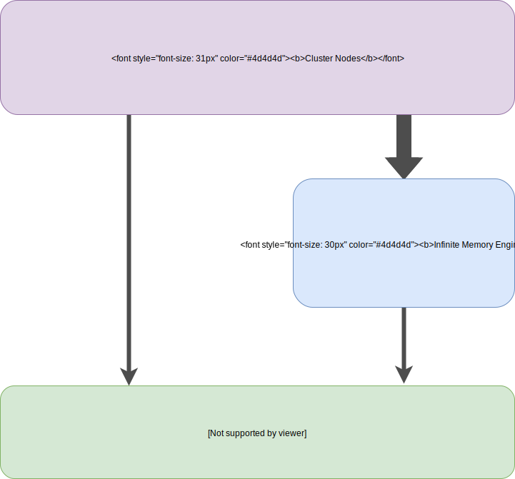
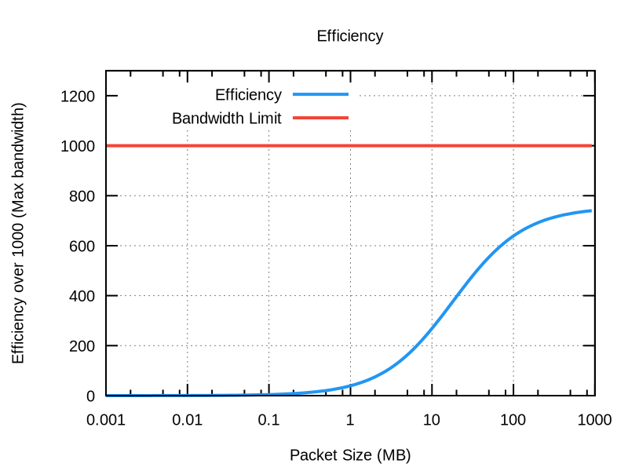

# Infinite Memory Engine

Daniele Tolomelli 

Supervisors:
 

Jean-Thomas Acquaviva
 

Stefano Cozzini
 

---

# Issue
IO Storage is extremely **slower** compared to the CPU capabilities and many problems are bound to the **IO bandwidth** 

RAID configurations mitigate this problem but still we reach at max 10GB/s of write at a high cost 

HDD did not have the improvement that CPU had in the last years. We instead developed different technologies

---

# Infinite Memory Engine

  * Uses **SSD as a buffer**
  * **Invisible** to the application for compatibility
  * Very **low latency**, useful for temporary storage

---

#Infinite Memory Engine

Pros:
  * Dumps quickly executed
  * The application can move forward not caring about IO
  * No modification to the existing code

IME is not effective if:
  * The next dump happens too early, when IME is still flushing data
  * The size of the dump exceed its capacity

---

# Scaling

The next step is to include IME in a network of servers with fast storage devices,
able to manage themselves. The target of this network is to:

  * Keep data consistency
  * Use a lightweight protocol that allows good scalability, correctly handling the communications

When we want to communicate data over the network, we must consider a lot of factors:

  * **Packet size** overhead to send the data with the correct informations
  * **Network latency**, that may increase in case of network traffic
  * **Checksum** to recover data avoiding resending packets

---

# Network times

Considering all these factors, the time for sending packets became this:

---

# Efficiency

Plotting the efficiency of the network highlights the problems

---

# Thank you
